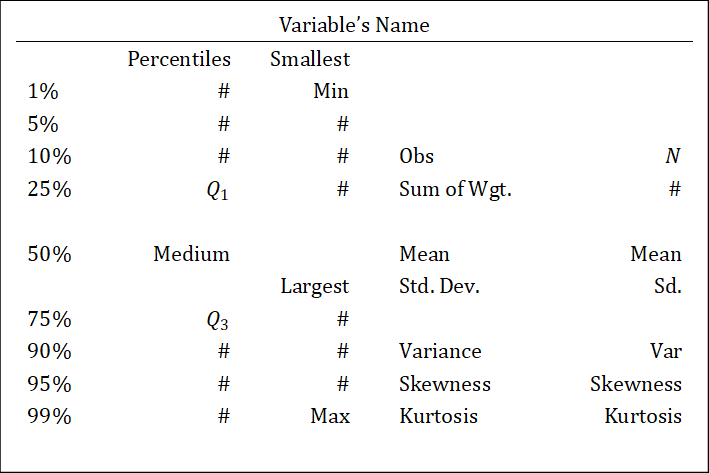

# (PART) 第二编 数据描述 {-}

# 数据的分布

数据的分布形态可以用统计图、统计表和统计量展示。本章介绍测量集中趋势与离散趋势的常用统计量。

集中趋势的常用统计量为均值（Mean）、中值（Medium）和众值（Mode）。离散趋势的常用统计量为极差（R）、四分互差（Q=Q_3-Q_1）、标准差/方差（Sd/Var）。

在Stata中，可以用`summarize`命令加上`detail`选项查看这些统计量（除去众数）。下面给出`summarize`的结果解释：

```{r}

```

众数查看，使用`tab`命令后接`sort`选项。返回的结果中，第一行即为众数。操作如下：

```stata
tab VarName, sort
```

