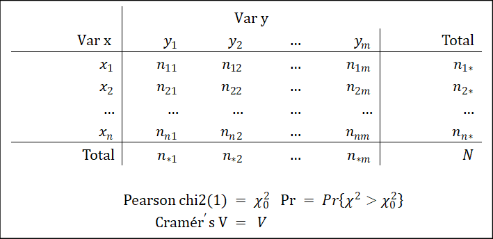

# 定类变量-定类变量

定类变量与定类变量之间的相关程度，可以用：(1)列联表检验，(2)发生比（当其为两个二分变量时），(3)比例检验。

## 列联表检验

### 基本概念 {#列联表检验基本概念}

假设有随机类别变量$X$，随机类别变量$Y$。总体中取值为$X=x_i$且$Y=y_j$的概率以$p_{ij}$表示，取值为$X=x_i$的概率以$p_{i*}$表示，取值为$Y=y_j$的概率以$p_{*j}$表示。

列联表格值$n_ij$表示取值为$X=x_i$且$Y=y_j$的观测值个数。边缘和$n_{i*}$表示取值为$X=x_i$的观测值个数，$n_{*j}$表示取值为$Y=y_j$的观测值个数。各格的期望值$E_ij=n_{i*}n_{*j}$。

列联表的原假设为二变量独立。用数学语言表示，则为

$$H_0:p_{ij}=p_{i*}p_{*j}$$

总体参数未可知，一般以观测值$n_{ij}$，$n_{i*}$，$n_{*j}$做点估计。列联表检验的检验统计量如下：

$$\chi^2=\sum_{i=1}^r\sum_{j=1}^c\frac{(n_{ij}-E_{ij})^2}{E_ij} \sim\chi^2 (\nu),\nu=(r-1)(c-1)$$

当$Pr\{\chi^2>\chi_0^2\}$时，可以拒绝原假设。从而，可以认为两个变量不独立。统计量V可以描述两个变量的相关强度：

$$V=\sqrt{\frac{\chi^2}{n(k-1)}},k=min(r,c)$$

让$\chi^2$除以$n$是为了消除样本量增大的影响，而除以$(k-1)$是为了将$V$的取值控制在$[0,1]$之间。

### 流程 {#列联表检验流程}

列联表检验的流程为：

1.  选择变量；
2.  建立原假设与备择假设；
3.  代入数据，计算检验统计量$\chi^2$，并比较统计量$Pr\{\chi^2>\chi_0^2\}$与给定的显著性水平$\alpha$，如果$Pr\{\chi^2>\chi_0^2\}<\alpha$，那么可以认为检验结果在统计上显著；
4.  若检验结果显著，计算列联强度$V$；
5.  若检验结果显著，进行解释。

### Stata操作 {#列联表检验Stata操作}

用Stata做列联表检验，需要进行的工作有：1.数据清理；2.列联表检验并计算列联强度。

数据清洗。我们知道，两个变量为定序变量。以类别变量的标准清洗之即可。详细操作见第一部分。

列联表检验并计算列联强度，需要`tab`命令后接`chi`和`V`选项。操作如下：

```stata
tab var1 var2, chi V
```

若要显示$E_{ij}$，只需添加`expect`选项（可缩写为`exp`）。

### 结果解读 {#列联表检验结果解读}

`tab`输出结果对应的统计量如下：

```{r}

```

## 发生比

当两个类别变量皆为二分变量时，可用发生比。则发生比OR（Odds Ratios）为

$$OR=\frac{病例组中暴露人数⁄病例组中非暴露人数}{对照组中暴露人数⁄对照组中非暴露人数}$$

OR值等于1，表示该因素对疾病的发生不起作用；OR值大于1，表示该因素是危险因素；OR值小于1，表示该因素是保护因素。

在Stata中，用`display`命令直接计算。
