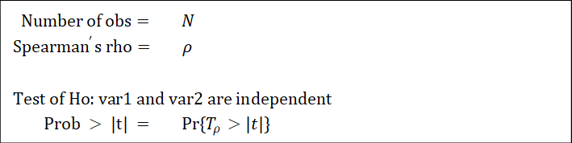
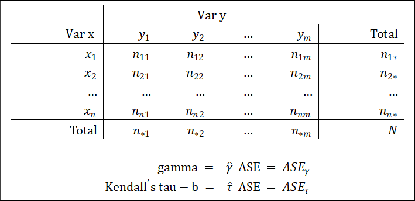

# 定序变量-定序变量 {#Chp08}

定序变量与定序变量之间的相关程度，可以用：(1)$\rho$系数（即斯皮尔曼等级相关系数），(2) $\gamma$系数/$\tau-b$系数测量。

## $\rho$系数及其检验

### 基本概念 {#斯皮尔曼系数基本概念}

$\rho$系数及其检验统计量的公式不要求掌握。只需知道，检验的原假设为$H_0: \rho=0$。记其检验统计量为$T_\rho$。

### 流程 {#斯皮尔曼系数流程}

$\rho$系数及其检验的流程为：

1.  选择变量；
2.  建立原假设与备择假设；
3.  代入数据，计算$\rho$系数即检验统计量$T_\rho$，并比较统计量$Pr\{T_\rho>|t|\}$与给定的显著性水平$\alpha$，如果$Pr\{T_\rho>|t|\}<\alpha$，那么可以认为检验结果在统计上显著，此时的$\rho$系数有统计意义（反之则无）；
4.  若检验结果显著，进行解释。

### Stata操作 {#斯皮尔曼系数Stata操作}

用Stata作$\rho$系数及其检验，需要进行的工作有：1.数据清理；2.$\rho$系数及其检验，结果分析。

数据清洗。我们知道，该检验的两个变量为定序变量。以类别变量的标准清洗之即可。详细操作见第一编。

斯皮尔曼检验，可以用`spearman`命令。操作如下：

```stata
spearman var1 var2
```

### Stata输出结果解释 {#斯皮尔曼系数Stata输出结果解释}

检验结果对应的统计量如下：

```{r}

```

第一行报告了样本容量。第二行报告了$\rho$的大小，仅当第四行的检验结果为统计显著时，该系数的大小有统计意义。第三行是原假设的陈述（即二变量独立）。第四行报告了$t$检验的结果，当$p$值小于0.05（或其他给定的显著性水平$\alpha$）时，可以拒绝原假设，进而根据$\rho$的大小判断。

## $\gamma$系数/$\tau-b$系数及其检验

### 基本概念 {#伽马系数基本概念}

$\gamma$系数及$\tau-b$系数的公式不要求掌握。只需知道：(1)检验的原假设为$H_0: \gamma=0$或是$H_0: \tau-b=0$；(2)在大样本下，两个系数均近似于服从均值为0的正态分布；(3)通过计算出的系数大小，及其渐近标准误ASE（即对系数的标准差的逼近），可对两个系数做Z检验，即构造检验统计量

$$Z_\gamma=\frac{\hat\gamma}{ASE_\gamma}\sim N(0,1),\ Z_\tau=\frac{\hat\tau }{ASE_\tau}\sim N(0,1)$$

当$Pr\{Z>Z_0\}<0.05$或$Pr\{Z<Z_0\}<0.05$时，可以拒绝原假设。该过程等价于：如果$0\in[-\infty,r-1.645*ASE]\cup [ r+1.645ASE,+\infty]$，则可以拒绝原假设。

### 流程 {#伽马系数流程}

$\gamma$系数/$\tau-b$系数及其检验的流程为：

1.  选择变量；
2.  建立原假设与备择假设；
3.  代入数据，计算$\gamma$系数/$\tau-b$系数；
4.  利用$ASE$和$\gamma$系数/$\tau-b$系数构造统计量$Z$，并比较统计量$Pr\{Z>Z_0\}$或$Pr\{Z<Z_0\}$与给定的显著性水平$\alpha$，如果$Pr\{Z>Z_0\}<\alpha$或$Pr\{Z<Z_0\}<\alpha$，那么可以认为检验结果在统计上显著，此时的$\gamma$系数/$\tau-b$系数有统计意义（反之则无）；
5.  若检验结果显著，进行解释。

### Stata操作 {#伽马系数Stata操作}

用Stata计算$\gamma$系数及$\tau-b$系数，需要进行的工作有：1.数据清理；2.计算系数；3.手动检验。

数据清洗。我们知道，两个变量为定序变量。以类别变量的标准清洗之即可。详细操作见第一编。

计算系数，需要`tab`命令后接`gamma`和`taub`选项。操作如下：

```stata
tab var1 var2, gamma taub
```

手动检验，需要`display`命令后接算式（假设检测出的系数大小为0.2，`ASE`为0.02；标红部分为需要根据上一步结果替换的部分）。操作如下：

```stata
di "[" 0.2-0.02*1.645 ", " 0.2+0.02*1.645 "]"
```

### Stata输出结果解释 {#伽马系数Stata输出结果解释}

`tab`输出结果对应的统计量如下：

```{r}

```

最后两行报告了系数及其渐近标准误。

