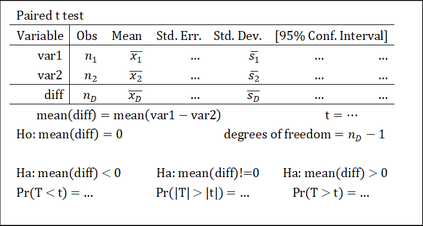
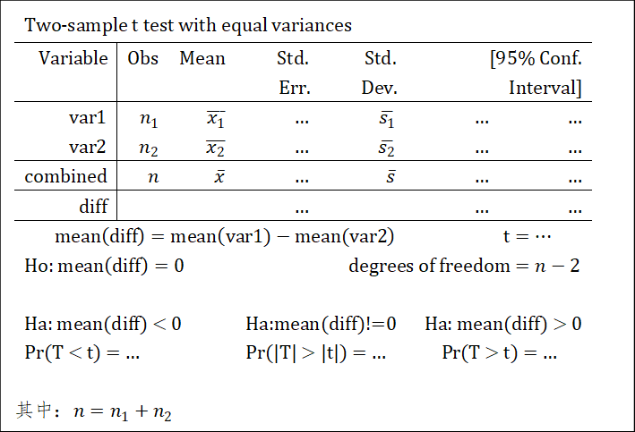
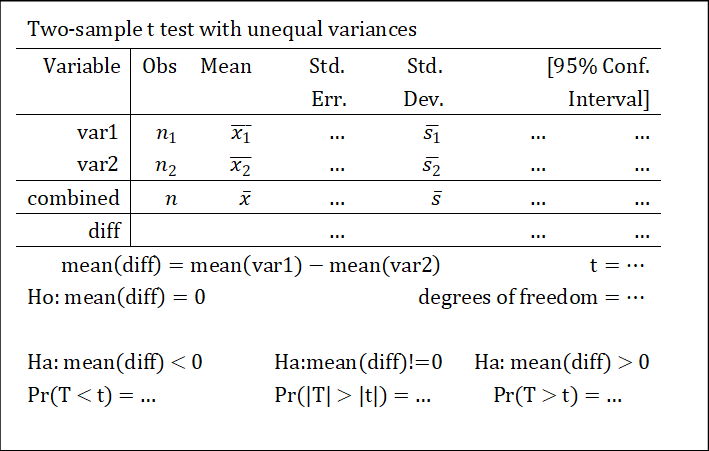
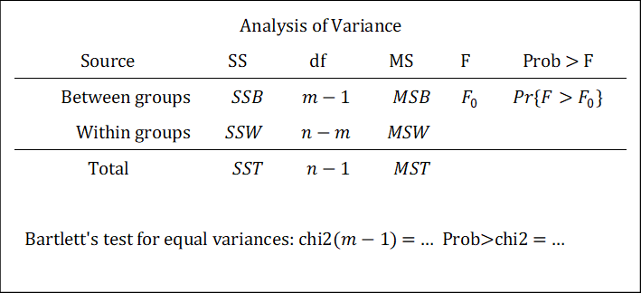
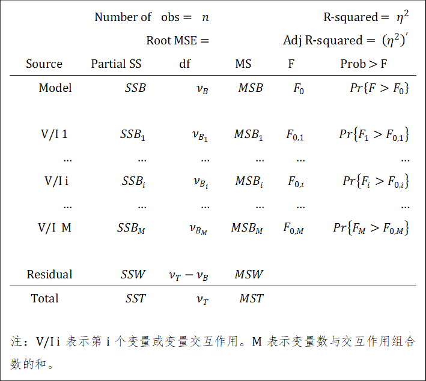

# 定类变量-定距变量 {#Chp09}

定类变量-定距变量之间的相关程度可以用(1)二总体均值差检验（当定类变量为二分变量时），(2)方差分析。

## 二总体均值差检验

### 基本概念 {#二总体均值差检验基本概念}

严格而言，二总体均值差检验仅仅指两个独立样本的均值差检验。配对样本实际上是单总体，总体即为配对差。不过这里我们还是同时给出二者的介绍。

#### 配对样本检验 {#基本概念配对样本检验}

假定总体$X$为前测，总体$Y$为后测，且$X$与$Y$中的个体一一对应。定义总体$D$为个体的后测与前侧的差。

建立原假设与备择假设

$$H_0: \mu_D=0 \leftrightarrow H_1: \mu_D≠0$$

对于任意大样本，由中心极限定律，可以构造检验统计量

$$T=\frac{\overline D}{S_D⁄\sqrt n}\sim t(n-1)$$
代入样本可计算出$T_0$。

对于小样本，当且仅当总体服从正态分布时有如上检验统计量。

#### 独立样本检验 {#基本概念独立样本检验}

假定总体$X$与总体$Y$独立，今欲检测二者的均值是否有差异。

建立原假设与备择假设

$$H_0: \mu_X=\mu_Y \leftrightarrow H_1: \mu_X≠\mu_Y$$

对任意大样本，根据中心极限定律，有：

当二总体满足方差齐性时，检验统计量

$$T=\frac{\overline X-\overline Y }{\sqrt{(\frac{1}{n_X}+\frac{1}{n_Y})\times \frac{(n_X-1) S_X^2+(n_Y-1) S_Y^2)}{n_X+n_Y-2}}}\sim t(n_X+n_Y-2)$$

当二总体不满足方差齐性时，检验量较为复杂，这里略去。

对小样本，当且仅当总体服从正态分布时有如上检验统计量。

### 流程 {#二总体均值差检验流程}

配对样本检验的流程为：

1.  选择变量；
2.  建立原假设与备择假设；
3.  是否是大样本，若不是，是否为正态总体，若仍不是，考虑其他检验方法；
4.  若是大样本，或为正态总体小样本，代入数据计算检验统计量$T_0$，并比较统计量$Pr\{T>T_0\}$或$Pr\{T<T_0\}$与给定的显著性水平$\alpha$，如果$Pr\{T>T_0\}<\alpha$或$Pr\{T<T_0\}<\alpha$，那么可以认为检验结果在统计上显著；
5.  若检验结果显著，进行解释。

独立样本检验的流程为：
1.  选择变量；
2.  建立原假设与备择假设；
3.  是否是大样本，若不是，是否为正态总体，若仍不是，考虑其他检验方法；
4.  若是大样本，或为正态总体小样本，根据方差齐性与否计算相应的检验统计量$T_0$，并比较统计量$Pr\{T>T_0\}$或$Pr\{T<T_0\}$与给定的显著性水平$\alpha$，如果$Pr\{T>T_0\}<\alpha$或$Pr\{T<T_0\}<\alpha$，那么可以认为检验结果在统计上显著；
5.  若检验结果显著，进行解释。

### Stata操作 {#二总体均值差检验Stata操作}

#### 配对样本检验 {#Stata操作配对样本检验}

用Stata进行配对样本检验，需要进行的工作有：1.数据清理；2.前提条件检验；3.检验与结果分析。

数据清洗。我们知道，前测与后测为定量变量。分清这一点后，我们就可以对做数据清洗操作。详细操作见第一编。

前提条件检验。根据前文流程，我们可能需要做的前提条件检验有：1.大样本与否；2.若为小样本，则正态性检验。

总体是大样本与否，可以用`tab`命令。操作如下（以`var1`，`var2`为定量变量）：

```stata
tab var1
tab var2
```

在`tab`中，关注格值。

正态性检验，可以用`swilk`命令（当分组容量在4到2000之间时，这一检验较为灵敏）或`sum`命令（当然也可以用`hist`命令绘图，直观感受）。我们已经知道，配对样本检验实则为单样本检验，故需先生成变量`d`。操作如下：

```stata
gen d = var1 – var2
swilk d
sum d, detail
```

在`swilk`中，关注结果中的Prob>z一栏，当该栏的值＞0.05时，可以认为满足正态性。在`sum`中，关注Skewness（偏度）和Kurtosis（峰度）。正态分布的偏度为0，峰度为3。如果偏度与峰度偏离正态分布的偏度与峰度不是很明显时，可以认为满足正态性。

配对样本检验的命令为`ttest`。`ttest`默认以配对样本的方式做检验。操作如下（二选一即可）：

```stata
ttest var1 == var2
ttest d == 0
```

#### 独立样本均值差检验 {#Stata操作独立样本均值差检验}

用Stata进行独立样本均值差检验，需要进行的工作有：1.数据清理；2.前提条件检验；3.方差分析与结果分析。

数据清洗。我们知道，二总体均为定量变量。分清这一点后，我们就可以对其做数据清洗操作。详细操作见第一编。

前提条件检验。根据前文流程，我们可能需要做的前提条件检验有：1.大样本与否；2.若为小样本，则正态性检验；3.方差齐性检验。

总体是大样本与否，可以用`tab`命令。操作如下（以`var1`，`var2`为定量变量）：

```stata
tab var1
tab var2
```

在`tab`中，关注格值。

正态性检验。可以用`swilk`命令（当分组容量在4到2000之间时，这一检验较为灵敏）或`sum`命令（当然也可以用`hist`命令绘图，直观感受）。操作如下：

```stata
swilk var1
swilk var2 
sum var1, detail
sum var2, detail
```

在`swilk`中，关注结果中的Prob>z一栏，当该栏的值＞0.05时，可以认为满足正态性。在`sum`中，关注Skewness（偏度）和Kurtosis（峰度）。正态分布的偏度为0，峰度为3。如果偏度与峰度偏离正态分布的偏度与峰度不是很明显时，可以认为满足正态性。

方差齐性检验。可用`sdtest`命令或`robvar`命令。`sdtest`命令操作如下：

```stata
sdtest var1 == var2
```

在`sdtest`中，关注最后三行的p值，若有小于0.05的，那么可以认为方差不等。
`robvar`命令可能有两种情况。若数据本身已经是长数据了，记分类变量为`var3`，定量变量为`var0`，则操作如下：

```stata
robvar var0, by(var3)
```

若数据本身是宽数据，需要先将宽数据转为长数据。记两个定量变量分别为`var1`和`var2`，则转化操作如下：

```stata
reshape long var, i(id)
//id需要填入用以识别的变量，reshape long后接变量名。例如要将income1 income2 income3转为长数据，那么即填入reshape long income, i(id)
//会自动生成一列名为_j的变量，取值即为共用名的后缀。例如，income1对应的_j取值即为1，income2对应的_j取值即为2，income3对应的_j取值即为3。
//变量原本的取值，将会被保存在新变量income中。而原变量income1，income2，income3会删除。其他变量不受影响。
```

转化后，`robvar`的操作如下：

```stata
robvar var, by(_j)
```

在`robvar`中，关注返回的三个Pr >F。当三者都＜0.05，则认为方差不齐。反之，可以认为方差齐性。

独立样本均值差检验。使用`ttest`命令。对宽数据：当方差齐性时，加`unpaired`选项；当方差不齐时，同时加`unpaired`选项和`unequal`选项。对长数据：当方差齐性时，加`by`选项；当方差不齐时，同时加`by`选项和`unequal`选项。操作如下：

```stata
ttest var1 == var2, unpaired // 若方差齐性
ttest var1 == var2, unequal // 若方差不齐
```

### Stata输出结果解释 {#二总体均值差检验Stata输出结果解释}

#### 配对样本 {#Stata输出结果解释配对样本}

```{r}

```

关注最后一行。若三个$p$值全都＞0.05（或给定的显著性水平$\alpha$），则原假设成立。反之，若有＜0.05（或给定的显著性水平$\alpha$），则选择$p$值最小的作为结论。

#### 独立样本 {#Stata输出结果解释独立样本}

若为方差齐性：

```{r}

```

关注最后一行。若三个$p$值全都＞0.05（或给定的显著性水平$\alpha$），则原假设成立。反之，若有＜0.05（或给定的显著性水平$\alpha$），则选择$p$值最小的作为结论。

```{r}

```

关注最后一行。若三个$p$值全都＞0.05（或给定的显著性水平$\alpha$），则原假设成立。反之，若有＜0.05（或给定的显著性水平$\alpha$），则选择$p$值最小的作为结论。

## 方差分析

### 基本概念 {#方差分析基本概念}

一定要记住的是，方差分析分析的是均值。之所以叫方差分析，是因为分析借用了方差。之所以用方差分析而不是多次$t$检验，是因为，多次$t$检验会导致犯错的概率上升：假定每一次$t$检验的显著性水平为$\alpha$。已知定类变量共有$m$个分类，那么一共要做$m-1$次$t$检验。由此，最终的结果不犯错的可能性为$(1-\alpha)^{m-1}$。取$\alpha=0.05$，$m=5$，则结果不犯错的可能性为0.8145。

方差分析的基本思路是：在分组的情况下，方差可看作由两部分构成，一部分是组内差异，一部分是组间差异。如果组间差异比组内差异多得多，那么可以认为，各分组之间均值存在差异。

#### 一元方差分析 {#基本概念一元方差分析}

首先讨论一元方差分析。假定分类变量$Y$有$m$个取值，由$Y$分组的连续变量$X$的各组均值分别为$\mu_1,\mu_2,…,\mu_n$。共有$n$个个体。

一元方差分析的假设：

$$H_0: \mu_1=\mu_2=...=\mu_n  \leftrightarrow H_1:Not\ H_0$$

一元方差分析的样本统计量有：组间偏差平方和$SSB$（也作$BSS$）、组内偏差平方和$SSW$（也作$RSS$，$SSE$）、总偏差平方和$SST$（即样本的修正方差，也作$TSS$）及三者的自由度与均方^[B指between，即组间；W指within，E指error，R指residual。组间差异，同时也可以理解为随机误差，或是剩余差异（未被模型解释的）；T指total。]，检验统计量$F$，相关比例$\eta^2$（即方差分析的效应量，也作$eta^2$，$R^2$）。下面给出各统计量的计算方法：

$$SSB=\sum_{i=1}^m\sum_{j=1}^{n_i}(\overline y_i-\overline y)^2 =\sum_{i=1}^mn_i(\overline y_i-\overline y)^2, SSW=\sum_{i=1}^m\sum_{j=1}^{n_i}(y_{ij}-\overline y_i)^2$$
$$SST=SSB+SSW=\sum_{i=1}^m\sum_{j=1}^{n_i}(y_{ij}-\overline y)^2$$

$$MSB=\frac{SSB}{m-1},MSW=\frac{SSW}{n-m},MST=\frac{SST}{n-1}$$

$$F=\frac{MSB}{MSW}\sim F(m-1;n-m),\eta^2=\frac{SSB}{SST}$$

如果$Pr\{F>F_0\}<\alpha$，那么可以认为组间均值差在统计上显著。$\eta^2$则报告了分组变量的解释力。

#### 二元方差分析 {#基本概念二元方差分析}

其次讨论二元方差分析。二元方差分析相当于三次一元方差分析。解释变量依次为：分类变量$A$，分类变量$B$，$A$和$B$的交互效应$I$。三次一元方差分析操作同一般的一元方差分析，除了交互作用的自由度$\nu_I=\nu_A\nu_B=(m_A-1)(m_B-1)$。在使用`anova`命令时，Stata会以正确的自由度来计算。

### 流程 {#方差分析流程}

方差分析的流程为：
1.	选择解释变量与被解释变量；
2.	检验数据是否满足方差分析的前提条件，如果检验结果为不满足，则需要处理数据或选择其他检验方法；
3.	建立原假设与备择假设；
4.	代入数据，计算统计量$F$，并比较统计量$Pr\{F>F_0\}$与给定的显著性水平$\alpha$，如果$Pr\{F>F_0\}<\alpha$，那么可以认为检验结果在统计上显著；
5.	若检验结果显著，计算相关比例$\eta^2$；
6.	若检验结果显著，进行解释。

其中，检验数据是否满足前提条件，可分为以下流程：

各分组样本是否皆为大样本（一般以≥30为标准）？
    1.  是。各分组容量是否相等？
        1.1.  是。满足前提假设。
        1.2.  否。各分组方差是否齐性？
            1.2.1  是。满足前提假设。
            1.2.2  否。不满足前提假设。需要非线性转换或是选用非参数方法检验。
    2.  否。各分组是否皆满足正态分布？
        2.1.  是。各分组方差是否齐性？
            2.1.1  是。满足前提假设。
            2.1.2  否。不满足前提假设。需要非线性转换或是选用非参数方法检验。
        2.2.  否。不满足前提假设。需要非线性转换或是选用非参数方法检验。

### Stata操作 {#方差分析Stata操作}

用Stata进行方差分析，需要进行的工作有：1.数据清理；2.前提条件检验；3.方差分析与结果分析。

数据清洗。我们知道，方差分析的因变量（被解释变量）为定量变量，而其自变量（解释变量）为类别变量。分清这一点后，我们就可以分别对其做数据清洗操作。详细操作见第一编。

前提条件检验。根据前文流程，我们可能需要做的前提条件检验有：1.分组容量齐性检验；2.分组正态性检验；3.分组方差齐性检验。

分组容量齐性检验，可以用`tab`命令或`sum`命令。操作如下（以收入`inc`为被解释变量，以性别`gender`为解释变量；以下三句任一句皆可）：

```stata
tab gender //限制条件if根据实际情况增加或是不增加
by gender, sort: sum inc
by gender, sort: sum inc, d //d即detail
```

在`tab`中，关注格值；在`sum`中，关注各分组结果中的Obs一栏。
分组正态性检验，可以用`swilk`命令（当分组容量在4到2000之间时，这一检验较为灵敏）或`sum`命令（当然也可以用`hist`命令绘图，直观感受）。操作如下：

```stata
by gender, sort: swilk inc
by gender, sort: sum inc, d
````

在`swilk`中，关注各分组结果中的Prob>z一栏，当该栏的值＞0.05时，可以认为该分组满足正态性。在`sum`中，关注Skewness（偏度）和Kurtosis（峰度）。正态分布的偏度为0，峰度为3。如果各分组的偏度与峰度偏离正态分布的偏度与峰度不是很明显时，可以认为各分组满足正态性。

方差齐性检验，可以用`sdtest`命令或`robvar`命令。一般而言，我们选用`robvar`。这是因为，`robvar`不要求正态性，并且可以对做多分组做方差齐性检验。操作如下：

```stata
robvar inc, by(gender)
```

在`robvar`中，关注返回的三个Pr>F。当三者都＜0.05，则认为方差不齐。反之，可以认为方差齐性。

分组方差分析的命令有`oneway`和`anova`两种。`oneway`仅支持一元方差分析，`anova`支持多元方差分析。在`anova`中，交互作用以`x#y`表示，而`x##y`表示`x`，`y`，以及`x#y`。操作如下（加入政治面貌变量`party`）：

```stata
oneway inc gender //这是一元的
anova inc gender##party //这是二元的，包含了交互作用
```

### Stata输出结果解释 {#方差分析Stata输出结果解释}

#### `oneway`结果解释

各格对应的统计量如下：

```{r}

```

其中，最后一行报告了各分组的方差齐性检验结果。不过一般我们以`robvar`的结果为准。

#### `anova`结果解释

```{r}

```

表的上方报告了个体数（num of obs），残差的标准差（root of mse），R-square（模型的解释力），修正的R-square（Adj R-square）。

Partial SS列表示各部分的偏差平方和：Model行的表示模型总共解释的，下面若干行依次表示变量/变量的交互解释的，Residual行表示未被模型解释的（也就是$SSR$/$SSE$/$RSS$）。

df列表示各行的$SS$对应的自由度。

MS列表示均方，即各行的$SS/df$所得。

F列表示模型与变量各行对应的检验统计量$F$的大小。

Prob>F列表示各行$F$的检验结果，若$p$值小于给定的显著性水平，可以认为对应行的变量（或交互作用）对因变量起作用。

