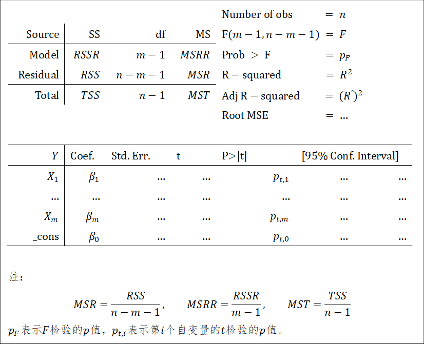

# 定距变量-定距变量

## 线性相关

两个定距变量间的线性相关性可以用相关系数反映。相关系数的检验用t检验完成（原假设为二变量无关，即相关系数为0）。

在Stata中，我们用`pwcorr`命令和`sig`选项计算并检验相关系数。相关操作如下：

```stata
pwcorr VarList, sig
```

在返回的结果中，每一个单元格的第一行为相关系数的大小，第二行为相关系数检验的$p$值。当$p$值小于给定的显著性水平时，方能认为相关系数有统计意义。

## 线性回归

### 基本概念 {#线性回归基本概念}

线性回归的各自变量系数，是用最小二乘法计算得到的。所谓最小二乘法，直观理解，就是寻找到一列的系数$β_0,β_1,β_2,…,β_m$，使得由这一系列系数确定的回归直线

$$y=β_0+\sum_{i=1}^mβ_ix_i+\epsilon$$

能解释最多的差异。

任何一组数据，都能够求出一条对应的回归直线。但是回归直线是否有用，需要经过检验。首先是回归直线本身的检验。这一检验类似于方差分析，利用$F$统计量（因此是$F$检验）。回归直线本身的检验的思想在于，因变量$Y$的方差可以分解为两部分，一部分为回归直线解释（记为$RSSR$），另一部分为剩余的未被解释的（记为$RSS$）。如果回归直线解释的部分较多，那么可以认为回归直线有统计显著性，反之则认为无。这一检验，要求因变量$Y$服从正态分布。以上各统计量的公式为：

$$RSSR=\sum_{i=1}^n(\hat y_i-\overline y)^2,RSS=\sum_{i=1}^n(y_i-\hat y_i)^2 $$
$$TSS=RSS+RSSR=\sum_{i=1}^n(y_i-\overline y)^2$$
$$F=\frac{RSSR⁄(m-1)}{RSS⁄(n-m-1)}\sim F(m-1,n-m-1)$$
其次是因变量与各因变量的线性相关性的检验（使用$t$检验）。如果自变量与因变量无线性相关性，则需要从模型中剔除之。在多元线性回归中，因变量与各自变量的相关性会用偏相关分析（目的在于消除共线性的影响），这也是为什么多元回归中，报告的线性相关系数可能会与两个变量直接用相关命令求得的线性相关系数不等的原因。
回归方程还有效应量

$$R^2=\frac{RSSR}{TSS}$$

该效应量描述了回归方程能解释的差异占总差异的比例。

### 流程 {#线性回归流程}

线性回归的流程为：
1.  选择解释变量与被解释变量（在选择的时候需要注意自变量与因变量是否有线性关系）；
2.	检验因变量是否满足正态总体假定，如果检验结果为不满足，则需要处理数据或选择其他检验方法；
3.	代入数据，计算回归直线，以及$RSSR$、$RSS$、$TSS$、$F$，并比较$Pr\{F>F_0 \}$与给定的显著性水平$\alpha$，如果$Pr\{F>F_0 \}<\alpha$，那么可以认为存在因变量与自变量存在关系；
4.	检验各个自变量与因变量，对检验结果不显著的项，予以剔除；
5.	若检验结果显著，进行解释。

### Stata操作 {#线性回归Stata操作}

暂略。

### Stata结果解释 {#线性回归Stata结果解释}

```{r}

```
